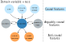

# Predictors from causal features do not generalize better to new domains

This is code to reproduce experiments in the paper:

> Predictors from causal features do not generalize better to new domains

Our code is build on TableShift and code from [Kim & Hardt (2023)](https://doi.org/10.1145/3617694.3623225). You can read more about TableShift at [tableshift.org](https://tableshift.org/index.html) or read the full paper (published in NeurIPS 2023 Datasets & Benchmarks Track) on [arxiv](https://arxiv.org/abs/2312.07577).

```

# Quickstart
We adapt the setup provided by TableShift.

**Environment setup:** It is recommended the use of docker with TableShift. The dataset construction and model pipelines have a diverse set of dependencies that included non-Python files required to make some libraries work. As a result, it is recommended you use the provided Docker image for using the benchmark, and suggest forking this Docker image for your own development.

```bash 
# fetch the docker image
docker pull ghcr.io/jpgard/tableshift:latest

# run it to test your setup; this automatically launches examples/run_expt.py
docker run ghcr.io/jpgard/tableshift:latest --model xgb

# optionally, use the container interactively
docker run -it --entrypoint=/bin/bash ghcr.io/jpgard/tableshift:latest

```

**Conda:** It is recommended using Docker with TableShift when running training or using any of the pretrained modeling code, as the libraries used for training contain a complex and subtle set of dependencies that can be difficult to configure outside Docker. However, Conda might provide a more lightweight environment for basic development and exploration with TableShift, so it is described how to set up Conda here. 

To create a conda environment, simply clone this repo, enter the root directory, and run the following commands to create and test a local execution environment:

```bash
# set up the environment
conda env create -f environment.yml
conda activate tableshift
# test the install by running the training script
python examples/run_expt.py
```

The final line above will print some detailed logging output as the script executes. When you see `training completed! test accuracy: 0.6221` your environment is ready to go! (Accuracy may vary slightly due to randomness.)

# Dataset Availability

The datasets we use in our paper are either publicly available, or provide open credentialized access.
The datasets with open credentialized access require signing a data use agreement. For the tasks `ICU Mortality` and `ICU Length of Stay`, it is required to complete  training CITI Data or Specimens Only Research, as they contain sensitive personal information.
Hence, these datasets must be manually fetched and stored locally.

A list of datasets, their names in our code, and the corresponding access levels are below. The string identifier is the value that should be passed as the `experiment` parameter to the `--experiment` flag of `experiments_causal/run_experiment_on_cluster.py`.
The causal, arguably causal, and anti-causal feature sets are obtained by appending `_causal`, `_arguablycausal` and `_anticausal` to the string identifier.


| Tasks                 | String Identifier         | Availability                                                                                                 | Source                                                                                                                 | Preprocessing |
|-------------------------|---------------------------|--------------------------------------------------------------------------------------------------------------|------------------------------------------------------------------------------------------------------------------------|-------------|
| Voting                  | `anes`                    | Public Credentialized Access ([source](https://electionstudies.org))                                         | [American National Election Studies (ANES)](https://electionstudies.org)                                               | TableShift |
| ASSISTments             | `assistments`             | Public                                                                                                       | [Kaggle](https://www.kaggle.com/datasets/nicolaswattiez/skillbuilder-data-2009-2010)                                   | TableShift |
| Childhood Lead          | `nhanes_lead`             | Public                                                                                                       | [National Health and Nutrition Examination Survey (NHANES)](https://www.cdc.gov/nchs/nhanes/index.htm)                 | TableShift |
| College Scorecard       | `college_scorecard`       | Public                                                                                                       | [College Scorecard](http://collegescorecard.ed.gov)                                                                    | TableShift |
| Diabetes                | `brfss_diabetes`          | Public                                                                                                       | [Behavioral Risk Factor Surveillance System (BRFSS)](https://www.cdc.gov/brfss/index.html)                             | TableShift |
| Food Stamps             | `acsfoodstamps`           | Public                                                                                                       | [American Community Survey](https://www.census.gov/programs-surveys/acs) (via [folktables](http://folktables.org))      |                                        | TableShift |
| Hospital Readmission    | `diabetes_readmission`    | Public                                                                                                       | [UCI](https://archive.ics.uci.edu/ml/datasets/Diabetes+130-US+hospitals+for+years+1999-2008)                           | TableShift |
| Hypertension            | `brfss_blood_pressure`    | Public                                                                                                       | [Behavioral Risk Factor Surveillance System (BRFSS)](https://www.cdc.gov/brfss/index.html)                             | TableShift |
| ICU Length of Stay      | `mimic_extract_los_3`     | Public Credentialized Access ([source](https://mimic.mit.edu/docs/gettingstarted/))                          | [MIMIC-iii](https://physionet.org/content/mimiciii/) via [MIMIC-Extract](https://github.com/MLforHealth/MIMIC_Extract) | TableShift |
| ICU Mortality           | `mimic_extract_mort_hosp` | Public Credentialized Access ([source](https://mimic.mit.edu/docs/gettingstarted/))                          | [MIMIC-iii](https://physionet.org/content/mimiciii/) via [MIMIC-Extract](https://github.com/MLforHealth/MIMIC_Extract) | TableShift |
| Income                  | `acsincome`               | Public                                                                                                       | [American Community Survey](https://www.census.gov/programs-surveys/acs) (via [folktables](http://folktables.org))      | TableShift |
| Public Health Insurance | `acspubcov`               | Public                                                                                                       | [American Community Survey](https://www.census.gov/programs-surveys/acs) (via [folktables](http://folktables.org))      | TableShift |
| Sepsis                  | `physionet`               | Public                                                                                                       | [Physionet](https://physionet.org/content/challenge-2019/)                                                             | TableShift |
| Unemployment            | `acsunemployment`         | Public                                                                                                       | [American Community Survey](https://www.census.gov/programs-surveys/acs) (via [folktables](http://folktables.org))       | TableShift |
| Utilization             | `meps`                    | Public ([source](https://meps.ahrq.gov/mepsweb/data_files/pufs/h216/h216dta.zip))                             | [Medical expenditure panel survey](https://meps.ahrq.gov/mepsweb/data_stats/download_data_files_detail.jsp?cboPufNumber=HC-216) |[Kim & Hardt (2023)](https://doi.org/10.1145/3617694.3623225) |
| Poverty                 | `sipp`                    | Public ([source](https://www2.census.gov/programs-surveys/sipp/data/datasets/2014/w1/pu2014w1_v13.dta.gz), [source](https://www2.census.gov/programs-surveys/sipp/data/datasets/2014/w2/pu2014w2_v13.dta.gz)) | [Survey of income and program participation](https://www.census.gov/sipp/)|[Kim & Hardt (2023)](https://doi.org/10.1145/3617694.3623225)|

TableShift includes the preprocessing of the data files in their implementation. For the tasks `Utilization` and `Poverty`, follow the instructions provided by [Kim & Hardt (2023)](https://doi.org/10.1145/3617694.3623225) in `backward_predictor/README.md`.

# Reproduction of experiments

The training script we run is located at `experiments_causal/run_experiment_on_cluster.py`.
It takes the following arguments:
* `experiment` (experiment to run)
* `model` (model to use)
* `cache_dir` (directory to cache raw data files to)
* `save_dir` (directory to save result files to)
* 
# Raw results of experiments
We provide the raw results of our experiments in the folder `experiments_causal/results/`. They contain a single `json` file for each task, feature selection and trained model.